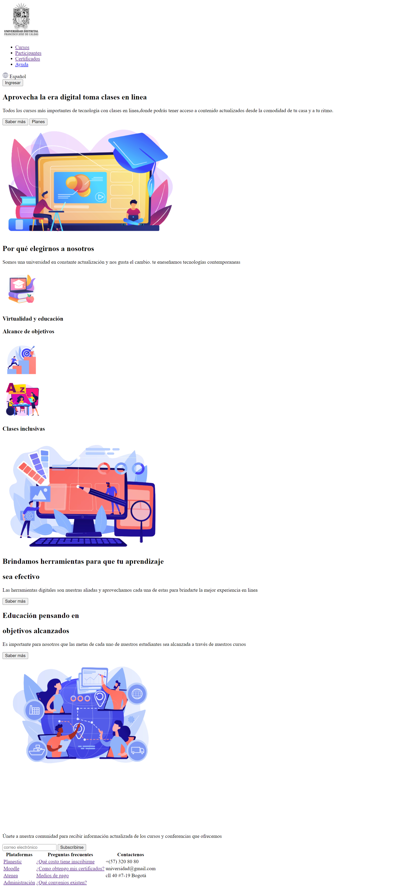
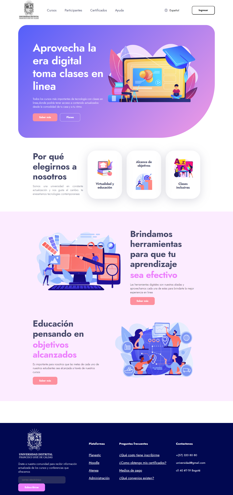

<h1>Taller 9 Estefania Huertas Grajales</h1>

<h2> Información</h2>

Curso: full Stack Basico - Grupo 1

Profesor: Cristian Patiño

<h2> Punto 1: Link figma</h2>

<a href="https://www.figma.com/file/qC86swrXD7bICVI6T708Qk/Estefan%C3%ADa-Huertas-Grajales?type=design&node-id=1701%3A2&mode=design&t=hwm7QgVbGYQOSjw4-1" target="_blank">Link de Figma</a>

<h2>Punto 2: HTML</h2>

<h2>Punto 3: CSS</h2>
